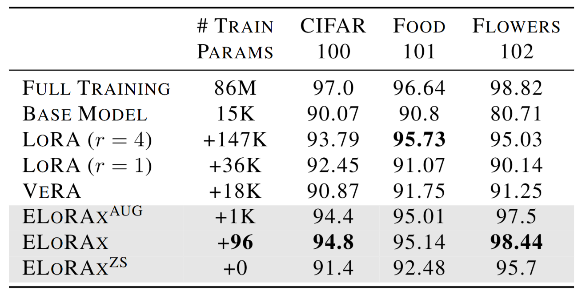

# ViT Image Classification with PEFT Methods

<p align="center">
  
</p>

## Usage

### Basic Training with LoRA

```bash
python train_vit.py \
    --method lora \
    --dataset CIFAR100 \
    --epochs 40 \
    --batch_size 128 \
    --lr 5e-6 \
    --subset_size 10 \
    --save_path ./checkpoints \
    --use_wandb
```

### Training with VeRA

VeRA requires predefined class subsets from a previous LoRA run for fair comparison:

```bash
python train_vit.py \
    --method vera \
    --dataset CIFAR100 \
    --sampled_subsets_path lora/CIFAR100/sampled_subsets.txt \
    --epochs 40 \
    --save_path ./checkpoints
```

### Training with EigenLoRA

EigenLoRA uses eigenvectors computed from multiple LoRA checkpoints:

```bash
python train_vit.py \
    --method elora \
    --dataset CIFAR100 \
    --lora_dict_directory ./checkpoints/lora/CIFAR100/model_checkpoints \
    --sampled_subsets_path lora/CIFAR100/sampled_subsets.txt \
    --elora_components 8 \
    --elora_holdout \
    --epochs 40
```

### Using the Shell Script

For convenience, use the provided shell script:

```bash
# Train LoRA on CIFAR-100
bash run_training.sh lora CIFAR100

# Train EigenLoRA on RESISC-45 with leave-one-out evaluation
bash run_training.sh elora RESISC45 --elora_holdout

# Customize via environment variables
EPOCHS=100 LR=1e-5 bash run_training.sh lora CIFAR10
```

## Command-Line Arguments

### Method Selection

| Argument | Default | Description |
|----------|---------|-------------|
| `--method` | `lora` | PEFT method: `lora`, `vera`, `elora`, or `none` (full fine-tuning) |

### Model Configuration

| Argument | Default | Description |
|----------|---------|-------------|
| `--model_name` | `google/vit-base-patch16-224` | HuggingFace model identifier |
| `--rank` | `8` | LoRA/VeRA rank parameter |
| `--elora_components` | `8` | Number of eigenvector components for EigenLoRA |

### Training Configuration

| Argument | Default | Description |
|----------|---------|-------------|
| `--epochs` | `40` | Number of training epochs |
| `--batch_size` | `128` | Batch size for training |
| `--lr` | `5e-6` | Learning rate |
| `--weight_decay` | `1e-6` | Weight decay for regularization |

### Dataset Configuration

| Argument | Default | Description |
|----------|---------|-------------|
| `--dataset` | `CIFAR100` | Dataset name |
| `--data_root` | `./data` | Root directory for dataset storage |
| `--subset_size` | `10` | Number of classes per subset |

### Paths

| Argument | Default | Description |
|----------|---------|-------------|
| `--save_path` | `./checkpoints` | Directory for saving model checkpoints |
| `--sampled_subsets_path` | `None` | Path to predefined class subsets file |
| `--lora_dict_directory` | `None` | Directory with LoRA checkpoints (for EigenLoRA) |

### EigenLoRA Specific

| Argument | Default | Description |
|----------|---------|-------------|
| `--elora_holdout` | `False` | Use leave-one-out evaluation |

### Logging

| Argument | Default | Description |
|----------|---------|-------------|
| `--use_wandb` | `False` | Enable Weights & Biases logging |
| `--wandb_project` | `ViT_PEFT` | W&B project name |
| `--wandb_entity` | `None` | W&B team/entity name |

## Supported Datasets

| Dataset | Classes | Train Size | Test Size |
|---------|---------|------------|-----------|
| CIFAR-10 | 10 | 50,000 | 10,000 |
| CIFAR-100 | 100 | 50,000 | 10,000 |
| Food-101 | 101 | 75,750 | 25,250 |
| Flowers-102 | 102 | 1,020 | 6,149 |
| Stanford Cars | 196 | 8,144 | 8,041 |
| RESISC-45 | 45 | 25,200 | 6,300 |

## Workflow Example

A typical experimental workflow:

```bash
# 1. Train LoRA models on all subsets
python train_vit.py --method lora --dataset CIFAR100 --use_wandb

# 2. Train VeRA with same subsets for comparison
python train_vit.py --method vera --dataset CIFAR100 \
    --sampled_subsets_path lora/CIFAR100/sampled_subsets.txt

# 3. Train EigenLoRA using LoRA-derived eigenvectors
python train_vit.py --method elora --dataset CIFAR100 \
    --lora_dict_directory ./checkpoints/lora/CIFAR100/model_checkpoints \
    --sampled_subsets_path lora/CIFAR100/sampled_subsets.txt \
    --elora_holdout
```

## Output Structure

```
checkpoints/
└── lora/
    └── CIFAR100/
        ├── sampled_subsets.txt           # Class subset definitions
        ├── label_mappings/
        │   ├── subset_1_mapping.json     # Class index remapping
        │   └── ...
        └── model_checkpoints/
            ├── subset_1_model.pth        # Trained model weights
            └── ...
```
